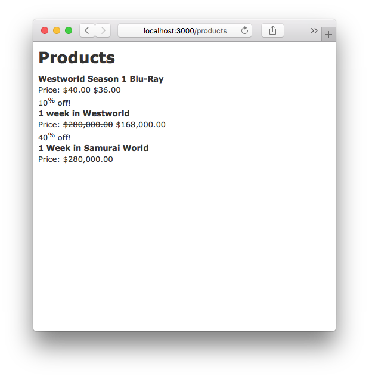

# Museo [](https://travis-ci.org/danielma/museo)

Museo is a library that provides snapshot testing utilities for Rails (>= 4) views.

Snapshot testing is a form of regression testing where the output of your views (given a set of state) is written to a file and compared against the historical version during testing. Any time there is a change in the rendered output of your views, Museo will show you the diff and cause your tests to fail. If the changes you see are what you expected, you can remove the previous version of the snapshot and make the new version the canonical output.

It supports Minitest and RSpec (2, 3).

## Installation

Add this line to your application's Gemfile:

```ruby
gem 'museo'
```

And then execute:

    $ bundle

Or install it yourself as:

    $ gem install museo

## Usage

### Configuration

`config/initializers/museo.rb`

```ruby
Museo.configure do |config|
  # Configure Museo to use RSpec (automatically set to true if spec directory exists)
  config.rspec = true
  
  # Stub the `render` method inside views
  config.stub(:render) do |options = {}, block = nil|
    options[:content] = capture(&block) if block
    options
  end
end
```

### CLI

The `museo` CLI has 2 commands: `list` and `clear`

```bash
$ museo help
Commands:
  museo clear [MATCHER]  # Clear snapshots that match MATCHER
  museo help [COMMAND]   # Describe available commands or one specific command
  museo list [MATCHER]   # List snapshots that match MATCHER
```

## Getting Started

Museo makes a custom testing command available to your controller tests to save and compare snapshots.

These examples will be written with Minitest, but there are examples below for how to work with RSpec as well.

_Note: all code from this guide can be found at the [museo-example](https://github.com/danielma/museo-example) repo_

Let's start with a simple setup and write some snapshot tests.

`app/controllers/products_controller.rb`

```ruby
class ProductsController < ApplicationController
  def index
    @products = Product.all
  end
end
```

`app/views/products/index.html.erb`

```erb
<h1 class="page-title">Products</h1>

<%= render partial: "product", collection: @products %>
```

`app/views/products/_product.html.erb`

```erb
<div class="product">
  <strong><%= product.name %></strong>
  <% if product.discounted? %>
    <div>
      Price: <strike><%= number_to_currency product.price %></strike>
      <%= number_to_currency product.discounted_price %>
    </div>
    <div><%= product.discount_percentage %><sup>%</sup> off!</div>
  <% else %>
    <div>
      Price: <%= number_to_currency product.price %>
    </div>
  <% end %>
</div>
```

It looks like this



Now, let's do some snapshot tests

First, include `Museo::RSpecIntegration` and write your first snapshot

```ruby
class ProductsController < ActionController::TestCase
  include Museo::MinitestIntegration
  
  describe "GET #index" do
    snapshot "with no params" do
      get :index
    end
  end
end
```

Then run the tests

```bash
$ bundle exec rspec
Run options: include {:focus=>true}

All examples were filtered out; ignoring {:focus=>true}

Randomized with seed 36544

ProductsController
  GET #index
Updated snapshot for "matches_snapshot_with_no_params.snapshot"
    matches snapshot: with no params

Top 1 slowest examples (0.04054 seconds, 98.4% of total time):
  ProductsController GET #index matches snapshot: with no params
    0.04054 seconds

Finished in 0.04118 seconds (files took 1.41 seconds to load)
1 example, 0 failures

Randomized with seed 36544
```

Notice where it says `Updated snapshot for "matches_snapshot_with_no_params.snapshot". This means there was no previous snapshot file and Museo generated a new one.

Museo uses a special layout file that includes the contents of every `content_for` block, so your snapshots will not break for layout changes, but will break for any change of a `content_for` block.

```bash
$ tree spec/snapshots
spec/snapshots
└── ProductsController
    └── matches_snapshot_with_no_params.snapshot

1 directory, 1 file
```

Now we have our first snapshot! Let's make some changes to our template and see what happens.

`app/views/products/index.html.erb`

```erb
<h1 class="title">Products</h1>

<hr />

<%= render partial: "product", collection: @products %>
```

```bash
$ bundle exec rspec
Run options: include {:focus=>true}

All examples were filtered out; ignoring {:focus=>true}

Randomized with seed 60210

ProductsController
  GET #index
    matches snapshot: with no params (FAILED - 1)

Failures:

  1) ProductsController GET #index matches snapshot: with no params
     Failure/Error: DEFAULT_FAILURE_NOTIFIER = lambda { |failure, _opts| raise failure }

       Snapshot did not match
       Diff:
       @@ -1,6 +1,8 @@
        <!-- content_for layout -->

       -<h1 class="page-title">Products</h1>
       +<h1 class="title">Products</h1>
       +
       +<hr />

        <div class="product">
          <strong>Westworld Season 1 Blu-Ray</strong>
```

Now we have an error letting us know that our snapshot didn't match.

If the diff is correct, we can clear out the old snapshot and regenerate it using the CLI tool

```bash
$ bundle exec museo clear ProductsController
Directory: /Users/danielma/Code/test/museo-example/test/snapshots/ProductsController

matches_snapshot_with_no_params.snapshot
Removing snapshots
```

Now that the snapshots are cleared, run the tests again to regenerate the snapshots.

```bash
$ bundle exec rspec
Run options: include {:focus=>true}

All examples were filtered out; ignoring {:focus=>true}

Randomized with seed 6462

ProductsController
  GET #index
Updated snapshot for "matches_snapshot_with_no_params.snapshot"
    matches snapshot: with no params
```

Include your snapshots in your version control repo for accurate history

### How can Museo help?

Let's say you decide to change some logic in your `_product.html.erb` partial. Museo can help you make sure the output is exactly what you expect.

In our `_product.html.erb`, we want to move the block for a non-discounted product above the block for a discounted product. We'll need a logic change.

`app/views/products/_product.html.erb`

```erb
<div class="product">
  <strong><%= product.name %></strong>
  <% if product.discounted? %>
    <div>
      Price: <%= number_to_currency product.price %>
    </div>
  <% else %>
    <div>
      Price: <strike><%= number_to_currency product.price %></strike>
      <%= number_to_currency product.discounted_price %>
    </div>
    <div><%= product.discount_percentage %><sup>%</sup> off!</div>
  <% end %>
</div>

```

```bash
$ bundle exec rspec
```

This command should include this failure:

```
Failures:

  1) ProductsController GET #index matches snapshot: with no params
     Failure/Error: DEFAULT_FAILURE_NOTIFIER = lambda { |failure, _opts| raise failure }

       Snapshot did not match
       Diff:


       @@ -7,16 +7,16 @@
        <div class="product">
          <strong>Westworld Season 1 Blu-Ray</strong>
            <div>
       -      Price: <strike>$40.00</strike>
       -      $36.00
       +      Price: $40.00
            </div>
       -    <div>10<sup>%</sup> off!</div>
        </div>
        <div class="product">
          <strong>1 Week in Samurai World</strong>
            <div> 
       -      Price: $280,000.00
       +      Price: <strike>$280,000.00</strike>
       +      $280,000.00
            </div>
       +    <div><sup>%</sup> off!</div>
        </div>
```

Hmmm, we didn't expect the snapshot to break in this case. We only wanted to change the way the file was written. Looks like the logic in our most recent change is broken.

We can fix it by changing `<% if product.discounted? %>` to `<% unless product.discounted? %>`

`app/views/products/_product.html.erb`

```erb
<div class="product">
  <strong><%= product.name %></strong>
  <% unless product.discounted? %>
    <div>
      Price: <%= number_to_currency product.price %>
    </div>
  <% else %>
    <div>
      Price: <strike><%= number_to_currency product.price %></strike>
      <%= number_to_currency product.discounted_price %>
    </div>
    <div><%= product.discount_percentage %><sup>%</sup> off!</div>
  <% end %>
</div>
```

And now, `bundle exec rspec` passes!

We have successfully made a change in our template without breaking the expected output.

### Advanced Usage

#### Stubbing methods in your views

In some cases, you may not desire to include the output from certain helpers in your snapshots. For example, if you are using the `react_rails` gem, you may not want to include the output from the `react_component` helper.

We can stub this method in the Museo configuration

`config/initializers/museo.rb`

```ruby
Museo.configure do |config|
  config.stub(:react_component) do |name, *_|
    name
  end
end
```

And use the helper in `views/products/index.html.erb`

```erb
<h1 class="title">Products</h1>

<hr />

<%= render partial: "product", collection: @products %>

<%= react_component "Components.Products", products: @products %>
```

Now, when we run `bundle exec rspec`, our new snapshots will no longer include the contents of the helper, but only the arguments we returned from our stub block.

```
Failures:

  1) ProductsController GET #index matches snapshot: with no params
     Failure/Error: DEFAULT_FAILURE_NOTIFIER = lambda { |failure, _opts| raise failure }

       Snapshot did not match
       Diff:
       @@ -20,6 +20,12 @@
        </div>


       +<!--
       +Stubbed method call: react_component
       +Components.Products
       +-->
       +
       +

        <!-- end layout -->
```

This allows us to snapshot views without the output from noisy helpers (eg `render partial:` etc)

## Prior Art

This library was inspired by [Jest Snapshot Testing](https://facebook.github.io/jest/blog/2016/07/27/jest-14.html). It wouldn't be here without the Jest team's hard work.

## Development

After checking out the repo, run `bin/setup` to install dependencies. Then, run `rake test` to run the tests. You can also run `bin/console` for an interactive prompt that will allow you to experiment.

To install this gem onto your local machine, run `bundle exec rake install`. To release a new version, update the version number in `version.rb`, and then run `bundle exec rake release`, which will create a git tag for the version, push git commits and tags, and push the `.gem` file to [rubygems.org](https://rubygems.org).

## Contributing

Bug reports and pull requests are welcome on GitHub at https://github.com/danielma/museo.

